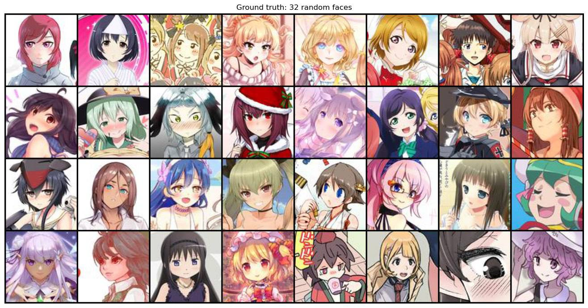
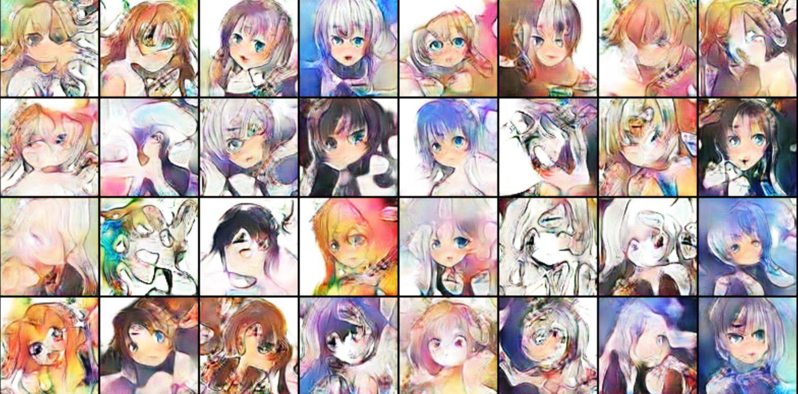
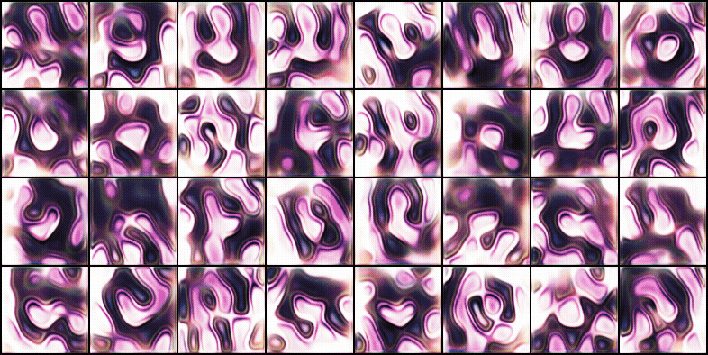

# DCGAN Anime Face Generation

This repository contains a small experimental project on generating anime-style face images with a DCGAN-like model. The goal was to train a generative adversarial network on a large set of anime face images and inspect whether the model can learn the visual structure of the dataset.

I am not an anime domain expert, so the evaluation here is intentionally simple and mostly visual.

## Dataset

The model was trained on approximately **115,000 anime face images**. The images were normalized to the `[-1, 1]` range and used as RGB training samples.

Example images from the training set:

## Model

The experiment uses a DCGAN-style adversarial setup:

- **Generator:** maps a 100-dimensional latent vector to a `96 x 96` RGB image.
- **Discriminator:** classifies real and generated images using convolutional layers with LeakyReLU activations.
- **Stabilization:** spectral normalization was used in the discriminator, and one-sided label smoothing was used for real labels.
- **Loss:** binary cross-entropy adversarial loss.
- **Optimizer:** Adam with learning rate `2e-4` and betas `(0.5, 0.999)`.

## Training Setup

- Dataset size: about **115k images**
- Epochs: **50**
- Batch size: **128**
- Hardware: **2x NVIDIA L4 GPUs**
- Training time: about **135 minutes**

## Results

Generated samples from the trained model:

Training progression over epochs:

Qualitatively, the model learns color palettes, approximate face layout, hair-like regions, and large anime-style eyes. However, many samples remain distorted and lack clear semantic structure.

After approximately the **10th epoch**, the samples appear to become less diverse and increasingly repetitive. This may indicate **mode collapse**, where the generator starts producing a narrower set of outputs instead of covering the full data distribution.

## Limitations

This project is a qualitative experiment rather than a complete benchmark. No FID, IS, precision-recall, or human preference metrics were computed. The mode collapse observation is based on visual inspection of the generated image grids.

## Files

- `main.ipynb` - training notebook
- `generated_images/` - generated samples, training snapshots, ground-truth examples, and GIF
- `weights/` - final saved model weights
